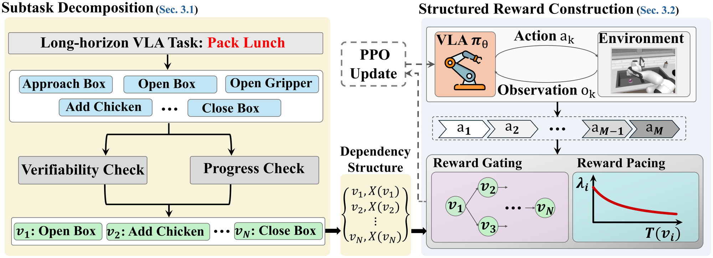
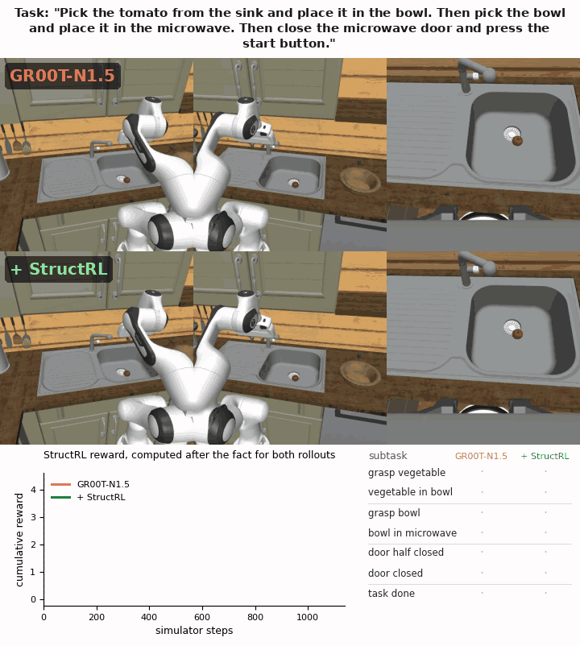

# StructRL: Online Structured Reinforcement Learning for Long-Horizon Vision-Language-Action Tasks

<p align="center">
Ziyi Yin<sup>1&dagger;*</sup>, Sangmin Woo<sup>2&dagger;</sup>, Kang Zhou<sup>2</sup>, Sungyeon Kim<sup>2</sup>, Aosong Feng<sup>2</sup>, Haibo Ding<sup>2</sup>, Luke Huan<sup>2</sup><br>
<sup>1</sup>The Pennsylvania State University &nbsp;&nbsp; <sup>2</sup>Amazon AWS AI<br>
<sub><sup>&dagger;</sup>Co-first authors &nbsp; <sup>*</sup>Work done during an internship at Amazon</sub>
</p>

<p align="center">
<a href="https://arxiv.org/abs/2609.36352"></a>
<a href="https://amazon-science.github.io/StructRL/"></a>
<a href="https://huggingface.co/papers/2609.36352"></a>
</p>

<p align="center"></p>

## How StructRL works

A long household task, such as *"put the chicken and the eggplant in the bowl, then put the bowl in the
fridge"*, takes many steps. If a robot policy is rewarded only when the whole task succeeds, most practice
attempts earn nothing, and the policy cannot tell an attempt that almost finished from one that failed
at the start. StructRL rewards the progress it can check:

1. **Split the task into checkable steps.** An LLM breaks the command into subtasks and keeps the ones
   that mark real progress and have a yes/no test on the simulator state (for example, "the chicken is
   in the bowl").
2. **Reward steps only in a sensible order.** A step earns reward only after the steps it depends on
   are done, and each step pays once.
3. **Reward timely steps more.** The sooner a step follows the previous rewarded one, relative to how
   long it takes in the demonstrations, the more it pays, which discourages stalling. Finishing the
   whole task pays a bonus.

StructRL uses these rewards for online RL (PPO, or GRPO) in [RLinf](https://github.com/RLinf/RLinf) and
fine-tunes GR00T-N1.5 and π0.5 on RoboCasa365 and LIBERO.

## Demo

GR00T-N1.5 (top) and GR00T-N1.5 + StructRL (bottom) on SteamInMicrowave, both starting from the same
RoboCasa365 scene, played at 6x speed. The panel shows the StructRL reward of both rollouts (computed after
the fact) and the subtasks each one completes. StructRL here uses the decomposition with about five subtasks
per task (N̄ = 5), the best setting of the density study.

<p align="center"></p>

More rollouts are on the [project page](https://amazon-science.github.io/StructRL/).

## Results

Success rate (%, higher is better) from Table 1 of the paper. RoboCasa365: 16 Composite-Seen tasks,
100 episodes each. LIBERO-Long: 10 tasks, 50 episodes each.

| Backbone | Method | RoboCasa365 | LIBERO-Long |
|---|---|:---:|:---:|
| GR00T-N1.5 | SFT | 38.6 | 90.6 |
| | Sparse-RL (PPO) | 40.2 | 91.2 |
| | SimpleVLA-RL (GRPO) | 41.5 | 92.4 |
| | **StructRL (PPO)** | **49.1** | **96.6** |
| π0.5 | SFT | 39.3 | 90.6 |
| | Sparse-RL (PPO) | 41.1 | 92.6 |
| | SimpleVLA-RL (GRPO) | 41.9 | 94.0 |
| | **StructRL (PPO)** | **45.8** | **96.2** |

## Getting started

**1. Get the code and the upstream projects** (details in [docs/INSTALL.md](docs/INSTALL.md)):

```bash
git clone https://github.com/amazon-science/StructRL.git && cd StructRL
export PROJECT_ROOT=$PWD
bash scripts/setup_upstream.sh   # RoboCasa365 with GR00T-N1.5
# add --openpi for π0.5 and --libero for LIBERO
```

**2. Set up the Python environments, datasets and SFT checkpoints** listed in
[docs/INSTALL.md](docs/INSTALL.md).

**3. Train and evaluate.** The launchers are Slurm scripts (training on 4 nodes x 8 GPUs); set
`<YOUR_PARTITION>` in them first.

```bash
# check the reward code
PYTHONPATH=. pytest structrl/test_timing_reward.py

# train StructRL with GR00T-N1.5 on RoboCasa365
sbatch launch/train_gr00t_structrl_ppo.sbatch
# checkpoints: $PROJECT_ROOT/RLinf/logs/<time>-train_gr00t_structrl_ppo/train_gr00t_structrl_ppo/checkpoints/global_step_N

# evaluate iteration 100 (16 tasks x 100 episodes)
python structrl/convert_rl_fullweights_to_hf.py \
    <run>/checkpoints/global_step_100/actor/model_state_dict/full_weights.pt \
    $PROJECT_ROOT/ckpts/gr00t_n1-5/foundation_model_learning/target_posttraining/composite_seen/checkpoint-60000 \
    $PROJECT_ROOT/ckpts/structrl_gr00t_step100
sbatch --export=ALL,NAME=structrl_gr00t,CKPT=$PROJECT_ROOT/ckpts/structrl_gr00t_step100 \
    launch/eval_gr00t_composite_seen.sbatch
# per-task results: $PROJECT_ROOT/eval_out/eval_structrl_gr00t/_summary_structrl_gr00t.csv
```

## Documentation

| Document | What it covers |
|---|---|
| [docs/INSTALL.md](docs/INSTALL.md) | pinned upstream code, Python environments, data and SFT checkpoints, cluster setup |
| [docs/REWARD.md](docs/REWARD.md) | how the reward is implemented, and the environment variables that control it |
| [docs/REPRODUCE.md](docs/REPRODUCE.md) | the command for every table and figure of the paper |
| [density/README.md](density/README.md) | the decomposition variants (density study, LLM decomposer, controls) |

## Repository layout

```
StructRL/
├── structrl/     the StructRL reward, task decompositions, evaluation and conversion tools
├── configs/      RLinf Hydra configs for RoboCasa365 (PPO / GRPO, GR00T-N1.5 / π0.5)
├── launch/       RoboCasa365 Slurm launchers (train_*, eval_*, sft_pi05.sh)
├── libero/       LIBERO configs, launchers, reference durations and evaluation harnesses
├── density/      decomposition-density variants and the Qwen3.5-9B decomposer
├── ablations/    reward-component ablation (Fig. 3) and beta sweep (Fig. 8)
├── grpo_diag/    GRPO advantage that also logs group statistics (GR00T-N1.5 GRPO runs)
├── patches/      patches for the pinned upstream repositories
├── envs/         frozen package lists of the environments used for the paper
├── scripts/      setup_upstream.sh
└── docs/         installation, reward, and reproduction guides
```

## Citation

```bibtex
@article{yin2026structrl,
  title   = {StructRL: Online Structured Reinforcement Learning for Long-Horizon Vision-Language-Action Tasks},
  author  = {Yin, Ziyi and Woo, Sangmin and Zhou, Kang and Kim, Sungyeon and Feng, Aosong and Ding, Haibo and Huan, Luke},
  journal = {arXiv preprint arXiv:2609.36352},
  year    = {2026}
}
```

## Acknowledgments

This code builds on [RLinf](https://github.com/RLinf/RLinf), [Isaac-GR00T](https://github.com/NVIDIA/Isaac-GR00T),
[openpi](https://github.com/Physical-Intelligence/openpi), [RoboCasa](https://github.com/robocasa/robocasa),
[robosuite](https://github.com/ARISE-Initiative/robosuite) and [LIBERO](https://github.com/Lifelong-Robot-Learning/LIBERO).

## Security

See [CONTRIBUTING](CONTRIBUTING.md#security-issue-notifications) for more information.

## License

This project is licensed under the CC-BY-NC-4.0 License; see [LICENSE](LICENSE). The patches in
`patches/`, the Hydra configs, and a few evaluation files are adapted from third-party projects and keep
their own licenses; see [THIRD-PARTY-LICENSES](THIRD-PARTY-LICENSES).

## About this release

This code is being released solely for academic and scientific reproducibility purposes, in support of
the methods and findings described in the associated publication. Pull requests are not being accepted in
order to maintain the code exactly as it was used in the paper.
